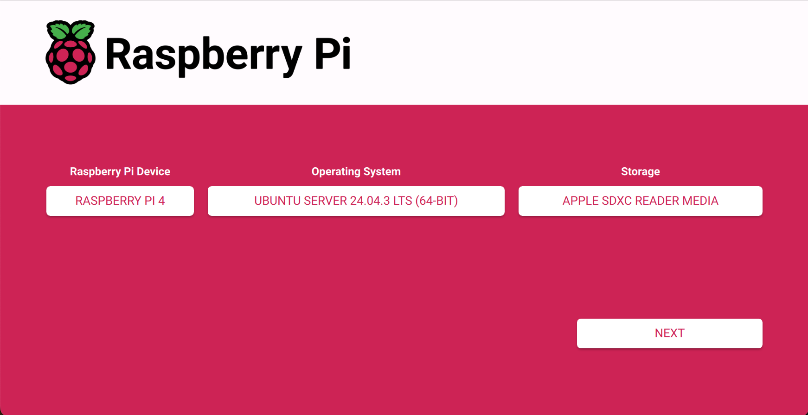

# Static Cloud-Init Configurations

This directory contains pre-built, static `cloud-init` `user-data` files for provisioning Raspberry Pi nodes. These configurations are designed for quick, non-interactive setup.

## Purpose

This approach is for users who want a simple, copy-and-paste solution without needing to generate a configuration interactively. Each file in this directory represents a complete, ready-to-use node configuration.

## When to Use This

- You need to quickly provision a node with a standard, pre-defined setup.
- You prefer to make minor customizations by editing a file directly rather than using an interactive script.
- You have a working configuration that you want to reuse without changes.

## Usage

1.  **Choose a Configuration**: Select the `user-data` file that matches your needs.
2.  **Customize (Optional)**: Open the chosen `user-data` file in a text editor and make any necessary changes, such as updating the `hostname` or adding your personal SSH public keys.
3.  **Flash the Image**: Use the modified `user-data` file with the Raspberry Pi Imager.

## Flashing the Image & Booting the Pi

The generated `user-data` file can be used with the **Raspberry Pi Imager**:

1.  Choose your desired Raspberry Pi Device
2.  Choose your desired OS (e.g., Ubuntu Server 22.04.3 LTS 64-bit).
3.  Choose your SD Card in Storage
4.  Click "Next" -> "Yes" (we don't care what settings it applies right now, just need system-boot available).
5.  Flash the Drive
6.  When finished, pull the SD card out and put it back in so it mounts system-data
7.  Overwrite the existing user-data file with the latest from the generator
8.  Pop into the RPI and let it do its thing!

When the Raspberry Pi boots with this SD card, `cloud-init` will automatically apply the settings defined in the `user-data` file.
