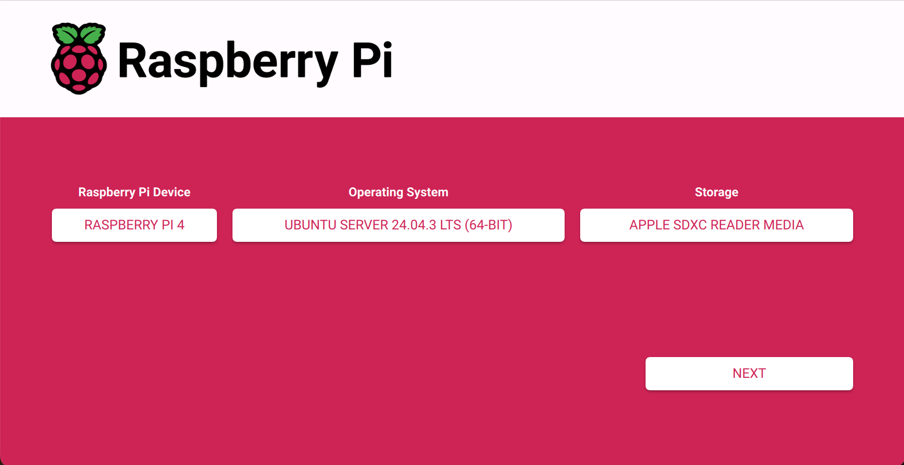

# Interactive Cloud-Init Generator

This project provides an interactive shell script to generate `cloud-init` `user-data` files for provisioning Raspberry Pi nodes. It allows for easy and repeatable setup of components like k3s, ArgoCD, Twingate, and more, turning a base OS image into a fully configured node with a single file.

## Features

- **Interactive Setup**: User-friendly prompts guide you through the configuration.
- **Core System Setup**: Configure hostname, SSH keys, and password authentication.
- **Kubernetes (k3s)**: Install k3s and configure it as a `first-control`, `additional-control`, or `worker` node.
- **ArgoCD**: Automatically install ArgoCD for GitOps workflows.
- **Monitoring**: Set up Node Exporter for Prometheus metrics.
- **Networking**: Install Twingate for secure, zero-trust remote access.
- **Hardware Support**: Optional installation of BlinkStick LED support for status indicators.
- **Modular & Extendable**: Easily add new components by creating new scripts in the `lib` and `templates` directories.

## Prerequisites

- A Unix-like environment (Linux, macOS).
- `bash` (v4.0 or newer is recommended).

## Usage

1.  Make the main script executable:

    ```bash
    chmod +x make-user-data-v3.sh
    ```

2.  Run the script:

    ```bash
    ./make-user-data-v3.sh
    ```

3.  Answer the interactive prompts to select the components and settings for your node.

4.  Once complete, the script will generate a `user-data` file in a timestamped subdirectory inside `output/`.

## Flashing the Image & Booting the Pi

The generated `user-data` file can be used with the **Raspberry Pi Imager**:



1.  Choose your desired Raspberry Pi Device
2.  Choose your desired OS (e.g., Ubuntu Server 22.04.3 LTS 64-bit).
3.  Choose your SD Card in Storage
4.  Click "Next" -> "Yes" (we don't care what settings it applies right now, just need system-boot available).
5.  Flash the Drive
6.  When finished, pull the SD card out and put it back in so it mounts system-data
7.  Overwrite the existing user-data file with the latest from the generator
8.  Pop into the RPI and let it do its thing!

## Configuration

Core system settings like the default timezone and base packages can be customized by editing the base template file before running the script.

- **File**: `templates/cloud-init-base.yaml`

For example, to change the timezone or add default packages that should be installed on every node, modify the following sections:

```yaml
# In templates/cloud-init-base.yaml

# ...
timezone: Etc/UTC

packages:
  # Basics
  - curl
  - git
  # Add your desired packages here
  - vim
  - tmux
# ...
```

## Project Structure

The project is organized to be modular and easy to understand.

```
3-interactive-generator/
├── make-user-data-v3.sh      # Main executable script
├── README.md                 # This documentation
├── lib/                      # Reusable shell functions for each component
│   ├── argocd.sh
│   ├── blinkstick.sh
│   ├── cloud-init-generator.sh
│   ├── helpers.sh
│   ├── kubernetes.sh
│   ├── monitoring.sh
│   ├── provision-report.sh
│   └── twingate.sh
└── templates/                # YAML snippets that are assembled by the script
    ├── cloud-init-base.yaml
    ├── runcmd/
    │   ├── argocd.yaml
    │   ├── blinkstick.yaml
    │   ├── k3s.yaml
    │   ├── monitoring.yaml
    │   ├── provision-report.yaml
    │   └── twingate.yaml
    └── write_files/
        ├── blinkstick.yaml
        └── provision-report.yaml
```

## How It Works & Extending the Generator

The script's modular design makes it easy to add support for new software or custom configurations. Here’s the workflow and how to add a new component called "MyCoolTool":

1.  **`make-user-data-v3.sh` (Entry Point)**: This script sources the `lib` files and calls their `setup_*` functions to ask the user questions.

    - **To Extend**: Add `source "$SCRIPT_DIR/lib/mycooltool.sh"` and `setup_mycooltool` to this file.

2.  **`lib/*.sh` (Component Logic)**: Each file contains functions for a component, like asking the user if they want to install it (`setup_*`) and providing its configuration (`get_*_config`).

    - **To Extend**: Create a new file `lib/mycooltool.sh`. Inside, create a `setup_mycooltool` function to ask the user if they want to install your tool and a `get_mycooltool_config` function that reads a template file.

3.  **`templates/**/\*.yaml`(Content Snippets)**: These files contain the static`cloud-init` YAML content.

    - **To Extend**: Create `templates/runcmd/mycooltool.yaml` with the `runcmd` commands needed to install your tool.

4.  **`lib/cloud-init-generator.sh` (The Engine)**: This script assembles the final `user-data` file. It calls the `get_*_config` functions for each enabled component and appends their content to the final configuration.
    - **To Extend**: Add a call to `get_mycooltool_config` inside the `generate_cloud_init` function, wrapped in a conditional check.
    ```bash
    # In lib/cloud-init-generator.sh
    if [[ "${INSTALL_MYCOOLTOOL:-N}" =~ ^[Yy]$ ]]; then
        runcmd+=$'\n'
        runcmd+=$(get_mycooltool_config)
    fi
    ```
